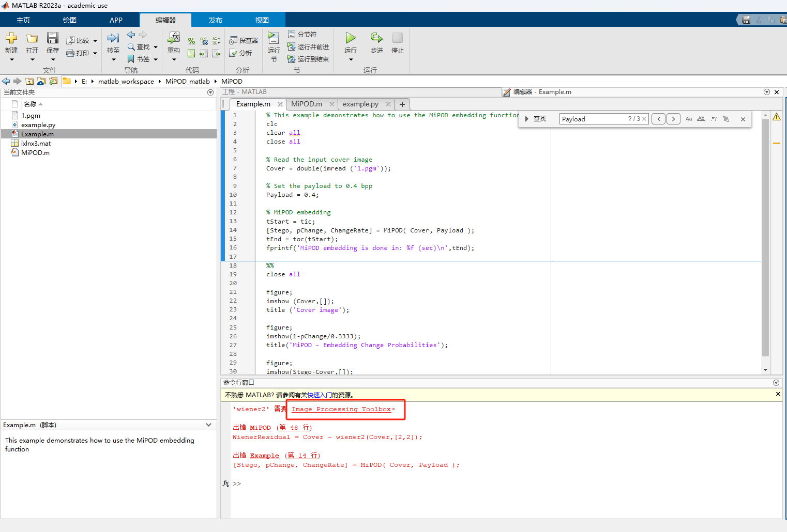
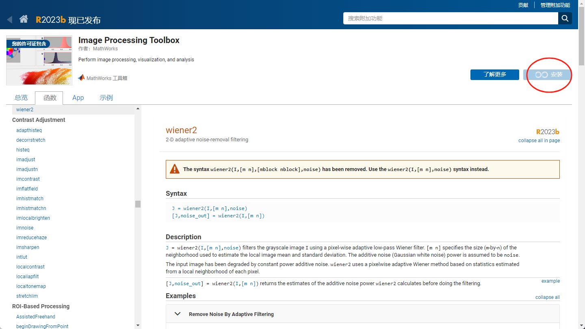
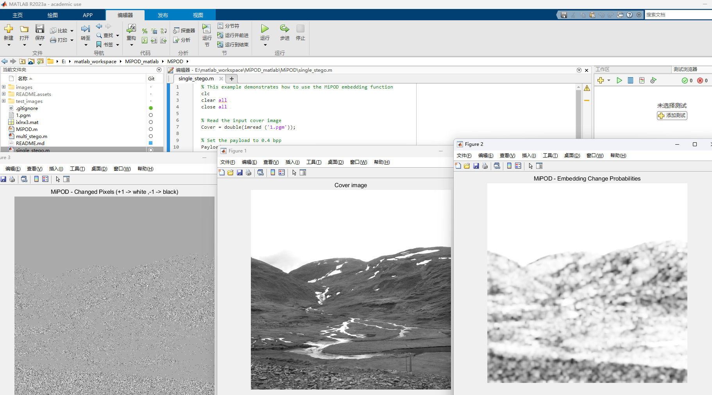

# MiPOD_matlab
使用matlab实现的MiPOD隐写方法

### 文件说明

single_stego.m : 使用根目录的1.pgm进行隐写，可以输出隐写的+-1图像。

multi_stego.m ：设置输入cover文件目录，输出stego文件目录。可以设置payload，比如0.4bpp。批量转stego。

MiPOD：算法框架

### 安装

内部网--正版软件--Matlab--R2023a

用学校邮箱注册

### 运行

第一次运行的时候会报错：

点击框内的插件还是扩展，进入安装就可以了。

后面直接点m文件运行：

